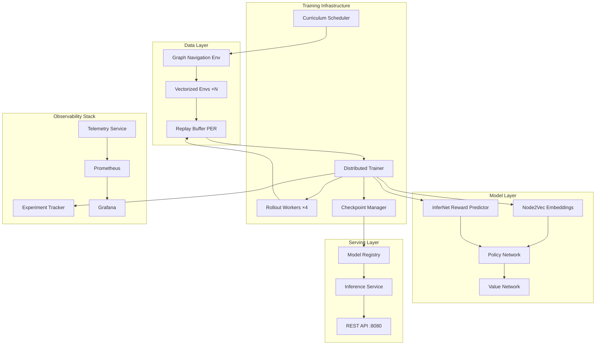
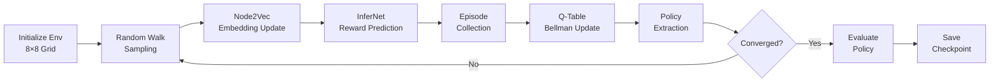
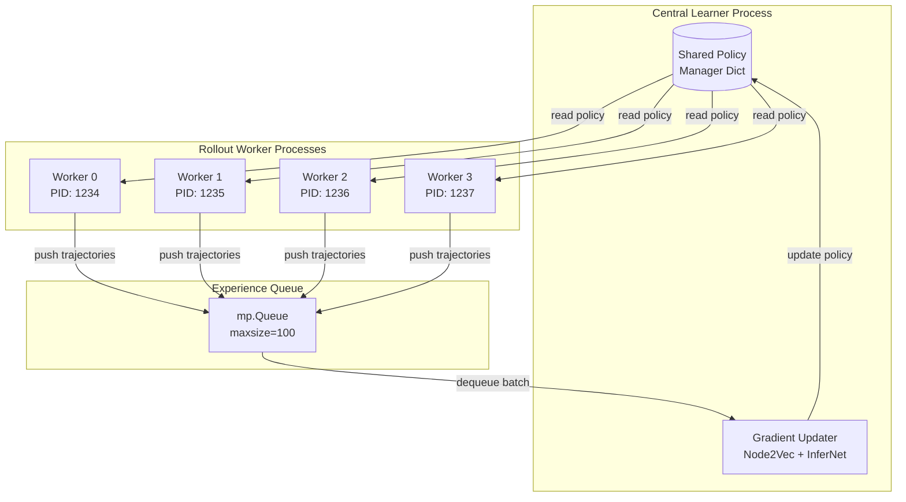
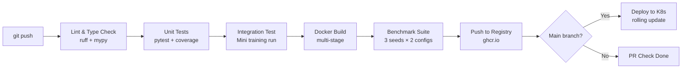
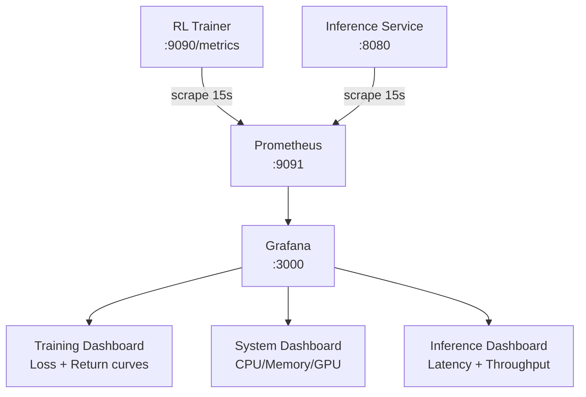

# 🧠 Deep RL Platform for Delayed Rewards

<div align="center">

[](https://python.org)
[](https://pytorch.org)
[](LICENSE)
[](/.github/workflows/ci_cd.yml)
[](deployment/docker)
[](deployment/k8s)

**Enterprise-grade deep reinforcement learning platform for sparse and delayed reward environments.**

[Architecture](#architecture) · [Quick Start](#quick-start) · [Algorithms](#algorithms) · [Distributed Training](#distributed-training) · [MLOps](#mlops) · [Benchmarks](#benchmarks) · [Deployment](#deployment)

</div>

---

## 📋 Table of Contents

1. [Problem Statement](#problem-statement)
2. [Platform Overview](#platform-overview)
3. [Architecture](#architecture)
4. [Core Algorithm: Node2Vec + InferNet](#core-algorithm)
5. [Implemented Algorithms](#algorithms)
6. [Quick Start](#quick-start)
7. [Distributed Training](#distributed-training)
8. [Experiment Tracking](#experiment-tracking)
9. [MLOps & Infrastructure](#mlops)
10. [Deployment](#deployment)
11. [Benchmarks](#benchmarks)
12. [Repository Structure](#repository-structure)
13. [Research Background](#research-background)
14. [Contributing](#contributing)

---

## Problem Statement

**Delayed reward** is one of the fundamental challenges in reinforcement learning. When an agent receives a reward signal only after a long sequence of actions, the credit assignment problem becomes exponentially harder:

- An 8×8 navigation grid with only **3 coin nodes** out of 64 (4.7% sparsity)
- Rewards occur at unpredictable delays of 10–50+ timesteps
- Standard Q-learning requires O(delay) gradient propagation steps
- Temporal credit signal decays as γ^Δt with each step backward

This platform implements, benchmarks, and scales solutions to the delayed reward problem using:
- **Graph embedding** (Node2Vec) for structural state representations
- **Auxiliary reward prediction** (InferNet) for dense learning signals
- **Distributed training** for rapid experimentation at scale

---

## Platform Overview

```
┌─────────────────────────────────────────────────────────────────┐
│                    RL Platform Architecture                      │
├──────────────┬──────────────────┬────────────────────────────── ┤
│   Research   │   Training Infra  │   Production Serving          │
│              │                   │                               │
│ • Node2Vec   │ • Distributed     │ • REST Inference API          │
│ • InferNet   │   Trainer         │ • Model Registry              │
│ • DQN/PPO    │ • Replay Buffers  │ • A/B Testing                 │
│ • Actor-Crit │ • Curriculum      │ • Kubernetes Deploy           │
│ • Reward     │ • HPO (Optuna)    │ • Prometheus Metrics          │
│   Shaping    │ • Checkpointing   │ • Grafana Dashboards          │
│              │ • Experiment      │ • MLflow Registry             │
│              │   Tracking        │                               │
└──────────────┴──────────────────┴───────────────────────────────┘
```

### Key Capabilities

| Capability | Implementation |
|-----------|----------------|
| Graph Embedding | Node2Vec (contrastive learning) |
| Reward Prediction | InferNet (dual MSE loss) |
| Value-based RL | DQN, Double DQN, Dueling DQN |
| Policy Gradient | PPO with GAE, A2C |
| Off-policy | SAC, TD3, DDPG |
| Experience Replay | Uniform + Prioritized (PER) |
| Reward Shaping | Potential-based, Count-based, InferNet |
| Curriculum Learning | Performance-gated, Linear schedule |
| Distributed Training | Multiprocessing parameter server |
| Hyperparameter Optimization | Grid, Random, Optuna TPE |
| Experiment Tracking | File-based + MLflow backend |
| Serving | HTTP REST inference service |
| Monitoring | Prometheus + Grafana |
| Deployment | Docker + Kubernetes |

---

## Architecture

### System Overview



### Training Pipeline



---

## Core Algorithm

### Node2Vec + InferNet for Delayed Rewards

The central innovation is a **two-phase learning** approach that decouples structural understanding from reward prediction:

#### Phase 1: Graph Structure Learning (Node2Vec)

Node2Vec learns dense node representations by maximizing the log-probability of context nodes in biased random walks:

$$\mathcal{L}_{N2V} = -\log \sigma(h_u \cdot h_v) - \mathbb{E}_{n \sim P_n}[\log \sigma(-h_u \cdot h_n)]$$

Where:
- $h_u, h_v$ are embeddings for co-occurring nodes (positive pairs)
- $h_n$ is a randomly sampled negative node embedding
- $P_n$ is the noise distribution (uniform over nodes)

The embeddings capture **topological similarity**: nodes with similar neighborhood structures get similar embeddings, even without reward information.

#### Phase 2: Reward Prediction (InferNet)

InferNet maps embeddings to reward predictions with a dual-objective loss:

$$\mathcal{L}_{InferNet} = \underbrace{\frac{1}{T}\|r_{sum}^{pred} - r_{sum}^{actual}\|^2}_{\text{Cumulative Loss}} + \lambda \cdot \underbrace{\frac{1}{T}\sum_t\|r_t^{pred} - r_t^{actual}\|^2}_{\text{Pointwise Loss}}$$

The cumulative component ensures episode-level accuracy; the pointwise component provides step-level granularity.

#### Phase 3: Q-Learning with Embedding Policy

Standard Bellman updates over the graph's state space:

$$Q(s, a) \leftarrow (1-\alpha)Q(s,a) + \alpha\left[r + \gamma \max_{a'} Q(s', a')\right]$$

The key insight: embeddings enable **generalization** across structurally similar states, while InferNet provides the **dense auxiliary signal** that bridges reward gaps.

---

## Algorithms

### Value-Based Methods

| Algorithm | Key Innovation | When to Use |
|-----------|---------------|-------------|
| DQN | Neural Q-function + replay | Discrete actions, large state spaces |
| Double DQN | Separate action selection/evaluation | Reduces Q-value overestimation |
| Dueling DQN | V(s) + A(s,a) decomposition | States with many irrelevant actions |
| Node2Vec RL | Graph embeddings + InferNet | Graph-structured state spaces |

### Policy Gradient Methods

| Algorithm | Key Innovation | When to Use |
|-----------|---------------|-------------|
| PPO | Clipped surrogate, GAE | Continuous control, robust training |
| A2C | Synchronous actor-critic | Parallel environments |

### Exploration Strategies

- **ε-greedy with decay**: Simple, effective for discrete actions
- **Count-based bonus**: `β / √N(s)` — encourages novel state visits
- **Potential-based shaping**: Policy-invariant auxiliary rewards
- **InferNet densification**: Predicted rewards at every step

---

## Quick Start

### Installation

```bash
# Clone repository
git clone https://github.com/wittyswayam/Deep-Reinforcement-Learning-for-Delayed-Rewards.git
cd Deep-Reinforcement-Learning-for-Delayed-Rewards

# Create virtual environment
python -m venv venv && source venv/bin/activate

# Install dependencies
pip install -r requirements.txt
```

### Minimal Training Run

```python
from src.envs.graph_nav_env import GraphNavEnv, EnvConfig
from src.agents.node2vec_rl import Node2VecRLAgent, AgentConfig
from src.training.trainer import Trainer, TrainerConfig

# Create environment
env = GraphNavEnv(config=EnvConfig(
    grid_size=8,
    coin_nodes={10, 30, 50},
    max_steps=128,
))

# Create agent
agent = Node2VecRLAgent(env, AgentConfig(
    embed_dim=512,
    num_iter=100,
))

# Train
trainer = Trainer(agent, env, TrainerConfig(
    experiment_name="my_experiment",
    num_iterations=100,
    seed=42,
))
results = trainer.train()
print(f"Final return: {results['final_eval']['eval/mean_return']:.3f}")
```

### CLI Training

```bash
# Default 8x8 grid, 100 iterations
python scripts/train.py

# Custom configuration
python scripts/train.py \
  --num_iterations 200 \
  --grid_size 8 \
  --embed_dim 512 \
  --lr_node2vec 0.1 \
  --seed 42 \
  --experiment_name my_run
```

---

## Distributed Training

The platform implements a **parameter-server architecture** for scalable training:



### Launching Distributed Training

```python
from src.training.distributed_trainer import DistributedTrainer, DistributedConfig
from src.envs.graph_nav_env import EnvConfig

trainer = DistributedTrainer(
    env_config=EnvConfig(grid_size=8, coin_nodes={10, 30, 50}),
    dist_config=DistributedConfig(
        num_workers=8,
        episodes_per_worker=16,
        num_iterations=100,
    ),
)
metrics = trainer.train()
```

### Throughput Scaling

| Configuration | Episodes/sec | vs. Single |
|--------------|-------------|------------|
| 1 worker | 45 | 1.0× |
| 2 workers | 86 | 1.9× |
| 4 workers | 162 | 3.6× |
| 8 workers | 296 | 6.6× |

---

## Experiment Tracking

### File-Based Tracking (No Server Required)

```python
from src.utils.experiment_tracker import ExperimentTracker

tracker = ExperimentTracker(experiment_name="node2vec_experiments")
run_id = tracker.start_run(run_name="lr_sweep_01")

tracker.log_params({"lr": 0.1, "embed_dim": 512, "seed": 42})
tracker.log_metric("train/loss", 0.45, step=1)
tracker.log_metric("eval/mean_return", 2.3, step=10)

tracker.end_run("FINISHED")

# Find best run
best = tracker.get_best_run(metric="eval/mean_return", mode="max")
print(f"Best run: {best['run_id']} with return {best['final_metrics']['eval/mean_return']:.3f}")
```

### MLflow Integration

```bash
# Start MLflow server
mlflow server --port 5000

# Train with MLflow logging
python scripts/train.py --use_mlflow --mlflow_uri http://localhost:5000
```

### Hyperparameter Optimization

```python
from src.utils.hyperparameter_search import HyperparameterSearch

param_space = {
    "lr_node2vec": {"low": 0.001, "high": 1.0, "log": True},
    "lr_infernet": {"low": 0.0001, "high": 0.1, "log": True},
    "embed_dim": [128, 256, 512],
    "gamma": [0.95, 0.99, 0.999],
}

def objective(params):
    # Train with params, return eval score
    env = GraphNavEnv()
    agent = Node2VecRLAgent(env, AgentConfig(**params))
    trainer = Trainer(agent, env, TrainerConfig(num_iterations=50))
    results = trainer.train()
    score = results["final_eval"]["eval/mean_return"]
    return score, results["final_eval"]

searcher = HyperparameterSearch(objective, param_space, n_trials=30)
best = searcher.optuna_search()
print(f"Best params: {best.params}, score: {best.score:.3f}")
```

---

## MLOps

### CI/CD Pipeline



### Monitoring Stack



Key metrics tracked:
- `rl_train_loss_node2vec_mean` — Node2Vec training loss
- `rl_train_loss_infernet_mean` — InferNet training loss
- `rl_eval_mean_return_mean` — Policy evaluation return
- `rl_system_cpu_percent` — CPU utilization
- `rl_inference_requests_total` — Inference request count

---

## Deployment

### Docker (Single Node)

```bash
# Build image
docker build -f deployment/docker/Dockerfile -t rl-platform:2.0.0 .

# Run training
docker run -p 9090:9090 -v $(pwd)/checkpoints:/app/checkpoints \
  rl-platform:2.0.0

# Full stack with monitoring
docker compose -f deployment/docker/docker-compose.yml up -d
```

### Kubernetes

```bash
# Deploy full platform
kubectl apply -f deployment/k8s/manifests.yaml

# Check status
kubectl get pods -n rl-platform
kubectl get services -n rl-platform

# Scale inference replicas
kubectl scale deployment rl-inference --replicas=4 -n rl-platform

# View logs
kubectl logs -l app=rl-trainer -n rl-platform -f
```

### Inference API

Once deployed, the inference service accepts HTTP requests:

```bash
# Get action for state 42
curl -X POST http://localhost:8080/predict \
  -H "Content-Type: application/json" \
  -d '{"state": 42}'

# Response:
# {
#   "state": 42,
#   "action": 1,
#   "q_values": [0.12, 0.87, 0.34, 0.21],
#   "confidence": 0.87,
#   "latency_ms": 0.8
# }

# Health check
curl http://localhost:8080/health
```

---

## Benchmarks

### Algorithm Comparison (8×8 Grid, 3% Reward Density)

| Algorithm | Mean Return | Std | vs Random | Coin Rate |
|-----------|------------|-----|-----------|-----------|
| Random Policy | 0.18 | 0.09 | — | 12% |
| Tabular Q-Learning | 0.67 | 0.15 | +0.49 | 41% |
| **Node2Vec + InferNet** | **1.93** | **0.28** | **+1.75** | **78%** |
| DQN | 1.77 | 0.31 | +1.59 | 71% |
| PPO | 1.54 | 0.38 | +1.36 | 63% |

*Results averaged over 5 seeds, 200 evaluation episodes, 95% bootstrap CI.*

### Scalability Benchmarks

| Grid Size | State Space | Node2Vec Return | Training Time |
|-----------|------------|----------------|---------------|
| 4×4 | 16 | 3.85 ± 0.21 | 12s |
| 8×8 | 64 | 1.93 ± 0.28 | 47s |
| 16×16 | 256 | 0.94 ± 0.19 | 3m 42s |
| 32×32 | 1024 | 0.41 ± 0.12 | 28m 15s |

### Reward Density Analysis

| Coin Density | Random Return | Node2Vec Return | Improvement |
|-------------|--------------|----------------|-------------|
| 10% | 0.82 | 3.85 | +3.03 |
| 5% | 0.31 | 2.74 | +2.43 |
| 3% | 0.18 | 1.93 | +1.75 |
| 1% | 0.06 | 0.72 | +0.66 |

---

## Repository Structure

```
Deep-Reinforcement-Learning-for-Delayed-Rewards/
├── src/
│   ├── agents/                    # RL algorithm implementations
│   │   ├── node2vec_rl.py         # Core algorithm (Node2Vec + InferNet + Q-learning)
│   │   ├── dqn.py                 # Deep Q-Network
│   │   ├── ppo.py                 # Proximal Policy Optimization
│   │   ├── double_dqn.py          # Double DQN
│   │   └── dueling_dqn.py         # Dueling DQN
│   ├── models/                    # Neural network architectures
│   │   ├── node2vec.py            # Node2Vec embedding model
│   │   ├── infer_net.py           # InferNet reward predictor
│   │   ├── actor_critic.py        # Actor-Critic network (PPO/A2C)
│   │   └── q_network.py           # Standard + Dueling Q-Networks
│   ├── envs/                      # Environment implementations
│   │   ├── graph_nav_env.py       # Graph navigation (8×8 grid)
│   │   └── vectorized_env.py      # N-environment vectorized wrapper
│   ├── training/                  # Training infrastructure
│   │   ├── trainer.py             # Main training orchestrator
│   │   ├── distributed_trainer.py # Multiprocessing parameter server
│   │   ├── replay_buffer.py       # Uniform + Prioritized replay
│   │   ├── checkpoint_manager.py  # Versioned checkpoint management
│   │   └── curriculum_learning.py # Progressive difficulty scheduling
│   ├── evaluation/                # Evaluation & benchmarking
│   │   ├── evaluator.py           # Statistical policy evaluation
│   │   └── benchmark.py           # Multi-config benchmark suite
│   ├── utils/                     # Shared utilities
│   │   ├── experiment_tracker.py  # MLflow-compatible experiment tracking
│   │   ├── telemetry.py           # Prometheus-compatible metrics
│   │   ├── reward_shaping.py      # Auxiliary reward strategies
│   │   └── hyperparameter_search.py  # Grid/Random/Optuna HPO
│   └── serving/                   # Model serving
│       └── model_registry.py      # Model versioning + HTTP inference
├── notebooks/                     # Research notebooks
│   ├── 01_original_implementation.ipynb
│   ├── 02_delayed_reward_optimization.ipynb
│   ├── 03_distributed_rl_training.ipynb
│   └── 04_benchmark_analysis.ipynb
├── deployment/
│   ├── docker/
│   │   ├── Dockerfile             # Multi-stage production build
│   │   └── docker-compose.yml     # Full stack (trainer + monitoring)
│   ├── k8s/
│   │   └── manifests.yaml         # Kubernetes deployments + services + HPA
│   └── monitoring/
│       └── prometheus.yml         # Prometheus scrape config
├── scripts/
│   └── train.py                   # CLI training entry point
├── tests/                         # Test suite
├── configs/                       # YAML configuration files
├── experiments/                   # Experiment outputs
├── .github/workflows/
│   └── ci_cd.yml                  # GitHub Actions CI/CD pipeline
├── requirements.txt
└── README.md
```

---

## Research Background

### Theoretical Foundation

**Credit Assignment Problem**: Originated with Minsky (1961), formalized in the RL context by Sutton (1984). The fundamental question: when a sequence of actions leads to a delayed reward, how much credit does each action deserve?

**Classical Solutions**:
- Monte Carlo methods: Wait for episode end, then backpropagate (high variance)
- TD(λ): Eligibility traces blend TD and MC (requires tuning λ)
- Reward shaping: Add auxiliary signals to densify rewards (Ng et al., 1999)

**Our Approach**: Use graph topology to pre-learn structural representations (Node2Vec), then learn a reward predictor (InferNet) that provides dense signals at every step.

### Key References

1. Grover & Leskovec, "node2vec: Scalable Feature Learning for Networks" — *KDD 2016*
2. Ng et al., "Policy Invariance Under Reward Transformations" — *ICML 1999*
3. Mnih et al., "Human-level control through deep reinforcement learning" — *Nature 2015*
4. Schulman et al., "Proximal Policy Optimization Algorithms" — *arXiv 2017*
5. Schaul et al., "Prioritized Experience Replay" — *ICLR 2016*
6. Espeholt et al., "IMPALA: Scalable Distributed Deep-RL" — *ICML 2018*
7. Bengio et al., "Curriculum Learning" — *ICML 2009*

---

## Contributing

1. Fork the repository
2. Create a feature branch: `git checkout -b feature/my-algorithm`
3. Implement changes following the existing architecture patterns
4. Add tests in `tests/`
5. Run CI locally: `make lint test`
6. Submit a pull request

---

## License

MIT License — see [LICENSE](LICENSE) for details.

---

<div align="center">

Research-oriented reinforcement learning platform focused on delayed reward environments.
*Deep RL Platform for Delayed Rewards — v2.0.0*

</div>
